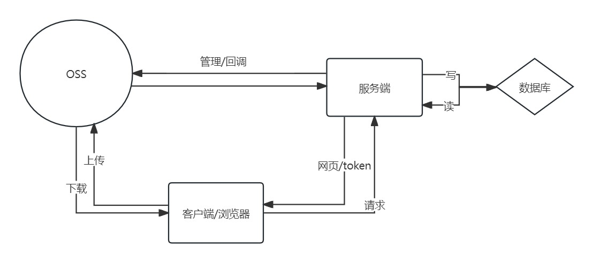
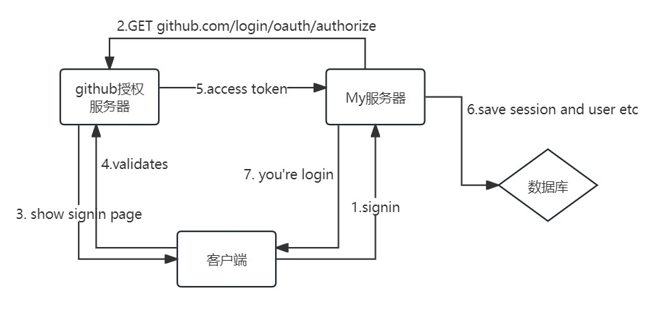
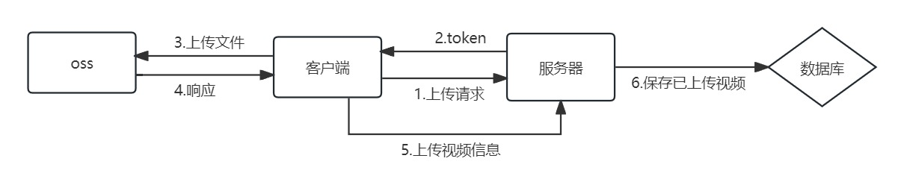
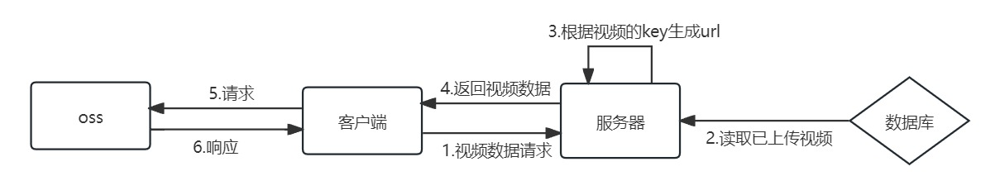
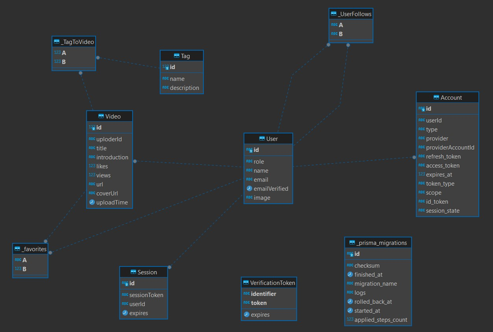

### 1. 系统概述

#### 1.1 功能简介

本项目基于nextjs构建，使用七牛云对象存储服务进行视频上传与访问，prisma，postgresql进行数据库读写，nextAuth进行第三方Oauth登录。用户可以用鼠标滚轮或上下键进行视频滚动浏览，选择视频标签分类，搜索视频关键词，登录后可收藏视频，关注上传者。其它功能包括夜间模式切换，自动播放开关。

#### 1.2 架构简介

### 2. 详细设计

#### 2.1 登录

登录模块使用nextAuth框架实现，本项目主要通过OAuth的方式登录

OAuth登录流程如下：

1. 应用程序请求访问服务器资源的授权

2. 如果用户验证通过该请求，应用程序会收到授权

3. 应用程序通过提供其自身身份和授权来向授权服务器 (API) 请求access token

4. 如果应用程序身份通过验证且授权有效，则授权服务器 (API) 向应用程序颁发access token。 授权完成。

5. 应用程序从资源服务器请求资源并提供访问令牌进行身份验证

6. 如果访问令牌有效，则资源服务器向应用程序提供资源

> 本项目仅提供github登录

获取access token后即可访问github账号的名称，邮箱，头像等，服务器会新建一个user将这些信息存入数据库

#### 2.2 上传

上传功能使用七牛云nodejs sdk和javascript sdk完成。nodejs sdk生成oss的访问token，客户端通过javascript sdk将客户端文件上传到oss

#### 2.3 视频播放

oss bucket为私有的，服务端将视频信息发送到客户端前会生成视频访问的的私有链接

视频请求为分页请求，每次请求5个视频数据，前端监听鼠标键盘等事件，动态切换视频

#### 2.4 收藏关注

相关业务功能均通过向服务端发送请求，读写数据库完成

数据库设计可查看schema.prisma

er图：

